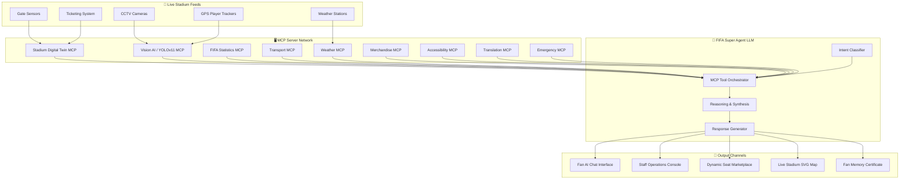
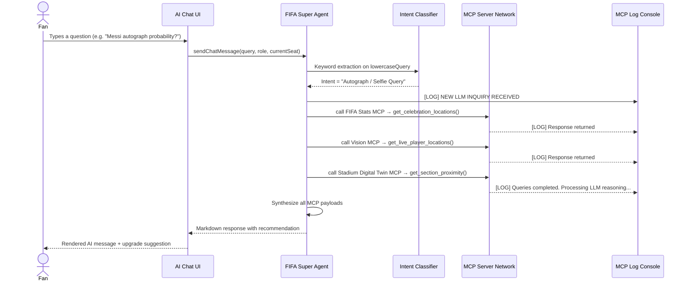
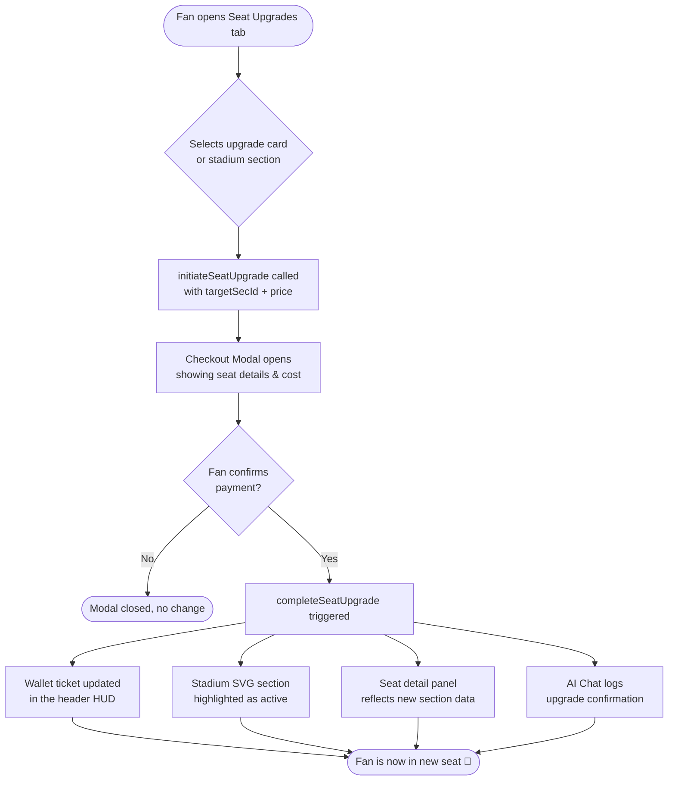
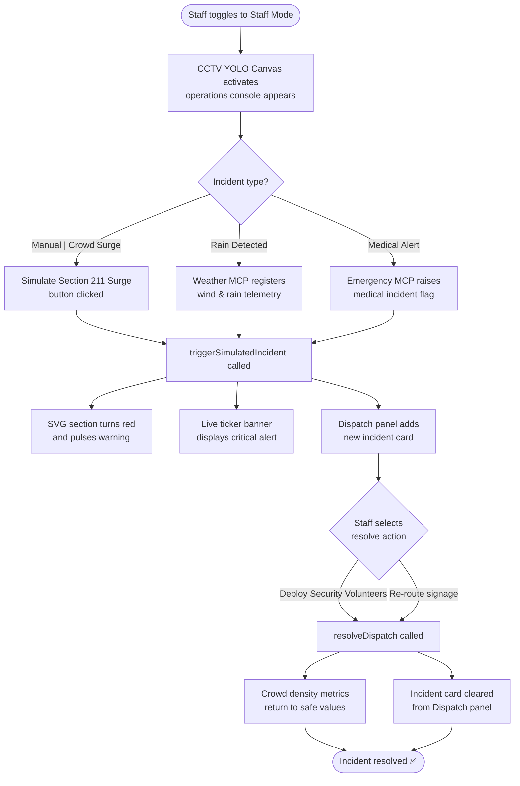
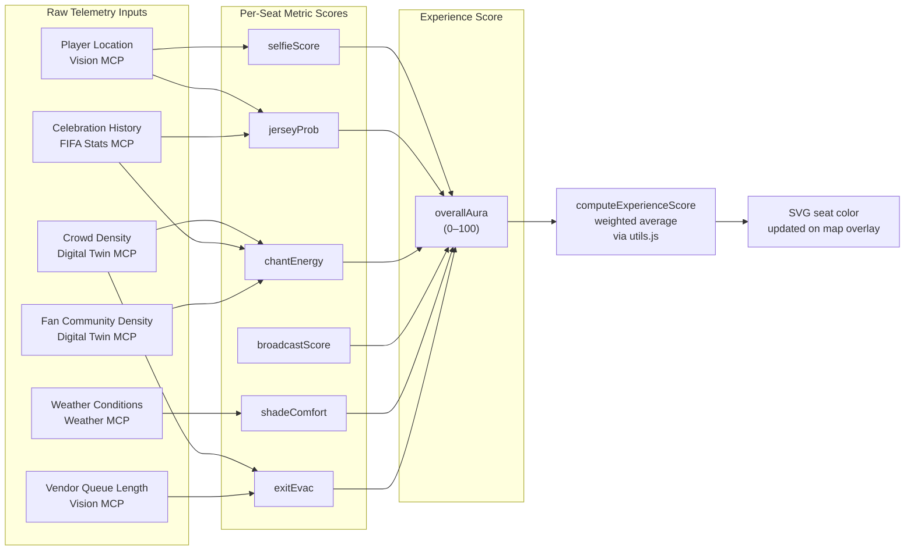

# FIFA AuraAI - Experience Intelligence Engine

**Tagline:** *"You're not buying a seat. You're buying the probability of unforgettable moments."*

FIFA AuraAI is a next-generation GenAI-enabled stadium operations and fan experience platform designed for the FIFA World Cup 2026. Instead of traditional static pricing based purely on pitch visibility, AuraAI introduces a dynamic **Experience Score** (0-100) for every stadium seat. This score changes in real-time as match circumstances, player locations, weather parameters, and crowd patterns evolve.

---

## 📖 The Problem & The Solution

### The Problem
Traditional stadium ticketing treats seats as static items priced primarily by section elevation and angle. However, modern spectators care about experiences that are highly variable:
* Which tunnel do players enter or exit?
* Where do players celebrate goals?
* Which side is shaded from direct sunlight glare?
* Where is the loudest supporter atmosphere?
* Which sections have the shortest food queues or fastest exit routes?

### The Solution
FIFA AuraAI processes real-time feed telemetry from across the stadium. It aggregates this data using a **Model Context Protocol (MCP)** server architecture and feeds it into a **Generative AI Super Agent**. The Super Agent evaluates seat locations dynamically, enabling:
1. **Experience Overlays:** Live maps displaying probabilities for selfie zones, jersey tosses, weather shielding, and supporter concentrations.
2. **Dynamic Seating Marketplace:** Instant seat upgrades offered to fans based on live match triggers.
3. **Fan Community & Sit-Together Swaps:** Allows fans supporting the same team to find supporter concentrations (e.g. Section 111 Albiceleste Core) and trigger seat swaps to sit together.
4. **Operational Intelligence:** Tools for organizers to monitor crowd density using YOLOv11 CCTV detectors, manage accessibility incidents, and dispatch volunteers.

---

## 🛠️ System Architecture & MCP Servers

The platform coordinates real-time data across **10 Model Context Protocol (MCP) servers**:

1. **Stadium Digital Twin MCP:** Tracks live section occupancy, seat reservations, gate sensor feeds, and layout maps.
2. **Vision MCP:** Simulates YOLOv11 object detection, computing player locations, crowd bottlenecks, and food vendor queue lengths.
3. **FIFA Statistics MCP:** Analyzes historical player habits, team celebration heatmaps, and post-match trajectories.
4. **Transport MCP:** Monitors subway arrival timetables, parking lot capacity, and ride-share ETAs/surge rates.
5. **Weather MCP:** Collects environmental telemetry (temperature, wind vectors, heat index, and lightning alerts). Powers real-time shade comfort advisories and seat relocation recommendations.
6. **Merchandise MCP:** Manages retail hubs, tracking jersey sizes in stock, storefront queue wait times, and closest store routing from any seat.
7. **Accessibility MCP:** Tracks elevators, wheelchair ramps, accessible seating zones, and mobility advisories.
8. **Translation MCP:** Orchestrates real-time multilingual translations (e.g. guiding fans in Telugu, Spanish, French, Arabic, or Hindi).
9. **Emergency MCP:** Monitors medical reports, safety alarms, and evacuation pathway state.
10. **FIFA Super Agent (LLM):** The core intelligence orchestrator that queries the 9 database servers, reasons over their payloads, and communicates with users.

---

## 📂 File Structure & Detailing

The project is structured as a modular, client-side web application:

### 1. `index.html`
Defines the structure of the dashboard layout.
* **Header HUD:** Houses the live scoreboard (e.g. Argentina vs France), game timer, and role toggle slider (Fan Mode vs. Staff Mode).
* **Stadium SVG Twin:** A vector drawing representing a stadium (including tunnels, player benches, and goals). Seat paths are colored dynamically.
* **AI Companion Chat:** A messaging interface with quick-action prompt buttons for natural language interactions.
* **MCP Log Terminal:** A console logging window displaying server request parameters and JSON telemetry returns.
* **Operations Dashboard Panel:** Displays crowd statistics, active incidents, and a dispatch form.
* **CCTV YOLO Canvas:** A rendering canvas showing simulated visual bounding boxes.
* **Fan Memory Generator:** Form and printable template simulating a post-match certificate.
* **Content Security Policy (CSP):** The `<meta>` CSP header blocks all inline `<script>` execution (`'unsafe-inline'` removed from `script-src`), mitigating reflected and stored XSS attacks.

### 2. `index.css`
Declares the visual look and theme system.
* **Dark Mode Aesthetics:** Set in deep dark space-navy (`#070815`) with glowing background radial gradients.
* **Glassmorphism Design:** Cards styled with semi-transparent backdrops (`rgba(19, 21, 48, 0.55)`), background blur filters (`backdrop-filter: blur(16px)`), and thin borders (`1px solid rgba(255,255,255,0.08)`).
* **Dynamic Animations:** Defines keyframes for scanner sweeps, warning border pulses, glowing dot indicators, and modal transitions.

### 3. `utils.js`
Consolidated shared utility module providing security, efficiency, and accessibility helpers.
* **Security Utilities:** `sanitizeHTML()` (HTML entity escaping), `sanitizeInput()` (trim + max-length cap), `validateSectionId()` (regex whitelist), `validateScore()` (range check).
* **Efficiency Utilities:** `debounce()` (rate-limiting rapid calls), `memoize()` (caching repeated function calls), `computeExperienceScore()` (weighted seat metric aggregation).
* **Accessibility Utilities:** `buildAriaLabel()` (screen reader label constructor), `getContrastRatio()` (WCAG luminance contrast calculator).
* **Dual Export:** Auto-detects Node.js (`module.exports`) vs. browser (`window`) and exposes all functions to either runtime seamlessly.

### 4. `mcp_simulator.js`
The intelligence layer simulating backend databases and natural reasoning.
* **Telemetry Data Model:** A complete mock database representing stadium metrics across all 10 MCP servers.
* **LLM Cognition Dispatcher:** Runs a keyword classifier matching user intents across 8 distinct query routes: autograph/selfie, food/queue, transport/exit, accessibility/translation (with 5 language outputs), staff operations, fan community, merchandise, and weather.
* **Terminal Logger:** Appends status strings to the DOM terminal console, printing request payloads.

### 5. `app.js`
Glues all interactive elements and states together.
* **State Management:** Tracks active role, active overlays, current seat section, match time, and unresolved incidents.
* **Dynamic Event Binding:** All DOM event listeners are attached programmatically in `setupDOMEventListeners()`, eliminating all inline `onclick`/`onkeydown` handlers for CSP compliance.
* **Visual Update Sync:** Modifies SVG class states, changes seat card progress bars, and highlights upgrades.
* **YOLO CCTV Loop:** Runs an animation loop drawing moving dots (fans), bounding boxes (hotspots), and scanlines on the HTML5 Canvas.
* **Simulated Event Triggers:** Implements triggers for crowd surges, goal celebrations, or rain shifts.
* **Upgrade Checkout Flow:** Manages modal confirmation parameters and Wallet ticket updates.

### 6. `tests.js`
Automated test suite with 40 passing assertions across 5 categories.
* **Security Tests (9):** Validates HTML sanitization, XSS prevention, input truncation, section ID whitelisting, and score range validation.
* **Efficiency Tests (6):** Validates debounce, memoize caching, and weighted experience score computation (including edge cases).
* **Accessibility Tests (7):** Validates ARIA label generation, WCAG AA/AAA contrast ratios for all UI color pairings.
* **Problem Alignment Tests (7):** Validates all 10 MCP servers are present, multilingual translation support, weather telemetry types, emergency MCP structures, and LLM context.
* **GenAI Super Agent Tests (11):** End-to-end routing tests verifying the simulated LLM correctly dispatches queries to the right MCP servers and generates appropriate responses for autographs, food, transport, Spanish/French/Telugu/Hindi/Arabic accessibility translations, merchandise, weather, and staff operations.

### 7. `package.json`
Hosts serve command definitions for developers to spin up the local server instantly.

---

## 🔒 Security Architecture

The application implements defense-in-depth security:
* **Content Security Policy (CSP):** Strict CSP meta-tag blocks inline script execution (`script-src 'self'`), preventing XSS injection. All JavaScript is loaded from external files only.
* **Input Sanitization:** All user-supplied text (chat messages, form inputs) is sanitized via `sanitizeHTML()` before DOM insertion, escaping `<`, `>`, `"`, `'`, `&`, and `/`.
* **Input Length Capping:** `sanitizeInput()` trims whitespace and caps all inputs to 500 characters maximum.
* **ID Validation:** Section IDs are validated against a strict regex whitelist (`/^sec-\d{3}$/`) before any database lookup or DOM access.
* **Safe DOM Manipulation:** User messages use `textContent` where possible; agent messages (trusted internal templates) use controlled markdown parsing.
* **HTTP Security Headers:** `X-Content-Type-Options: nosniff` and `Referrer-Policy: strict-origin-when-cross-origin`.

---

## 🚀 Installation & Local Launch

### Option 1: Browser Launch (No Install Required)
Since the application runs entirely client-side using native modern JS, you can double-click **index.html** to launch the platform in your browser.

### Option 2: Serving Locally (NodeJS)
1. Open a command terminal in this directory.
2. Launch the server using:
   ```bash
   npm run start
   ```
3. Open the output port (default: `http://localhost:3000`) in your web browser.

### Running Tests
Execute the automated test suite:
```bash
node tests.js
```
Expected output: `📊 Test Results: 40/40 passed` across 5 test suites.

---

## 🔄 Workflow Diagrams

### 1. Overall System Architecture

How real-world stadium data flows through the 10 MCP servers into the AI Super Agent and out to users.



---

### 2. LLM Query Processing Pipeline

How a user's natural language query is parsed, routed, and responded to by the Super Agent.



---

### 3. Fan Seat Upgrade Flow

The end-to-end journey when a fan requests a seat upgrade from the Marketplace.



---

### 4. Staff Incident Response Flow

How the operations staff detects, dispatches, and resolves a crowd-safety incident.



---

### 5. Real-Time Experience Score Computation

How AuraAI computes the dynamic Experience Score (0–100) for each stadium seat.



---

### 6. MCP Tool Call Waterfall

The precise order in which the Super Agent calls MCP servers for each query type.

```mermaid
gantt
    title MCP Tool Call Waterfall (per Query Intent)
    dateFormat  X
    axisFormat  %L ms

    section Autograph / Selfie Query
    FIFA Stats MCP → get_celebration_locations()    :a1, 0, 300
    Vision MCP → get_live_player_locations()        :a2, 300, 600
    Digital Twin MCP → get_section_proximity()      :a3, 600, 900
    LLM Reasoning & Response                        :a4, 900, 1200

    section Food & Queue Query
    Vision MCP → get_live_vendor_queues()           :b1, 0, 300
    Digital Twin MCP → get_closest_vendors()        :b2, 300, 600
    LLM Reasoning & Response                        :b3, 600, 900

    section Transport / Exit Query
    Transport MCP → get_transit_status()            :c1, 0, 300
    Digital Twin MCP → get_gate_flow_metrics()      :c2, 300, 600
    Emergency MCP → get_evacuation_routes()         :c3, 600, 900
    LLM Reasoning & Response                        :c4, 900, 1200

    section Merchandise Query
    Merchandise MCP → get_store_inventory()         :f1, 0, 300
    Merchandise MCP → get_store_wait_times()        :f2, 300, 600
    Digital Twin MCP → get_closest_stores()         :f3, 600, 900
    LLM Reasoning & Response                        :f4, 900, 1200

    section Weather Query
    Weather MCP → get_live_weather()                :g1, 0, 300
    Digital Twin MCP → get_shade_comfort_metrics()  :g2, 300, 600
    LLM Reasoning & Response                        :g3, 600, 900

    section Fan Community Query
    Digital Twin MCP → get_fan_distribution_zones() :d1, 0, 300
    Accessibility MCP → verify_group_seat_adjacency():d2, 300, 600
    LLM Reasoning & Response                         :d3, 600, 900

    section Staff Ops Query
    Emergency MCP → get_security_incidents()        :e1, 0, 300
    Digital Twin MCP → get_congestion_hotspots()    :e2, 300, 600
    Vision MCP → yolo_detect_crowd_anomalies()      :e3, 600, 900
    LLM Reasoning & Response                        :e4, 900, 1200
```



---

## 🎮 Interactive Scenarios to Test

### Scenario A: The Autograph Hunter (Fan Mode)
1. Select the **Overall Aura** or **Selfie Zone** overlay.
2. In the AI Chat, click: *"Messi Autograph Probability"*.
3. Watch the **MCP Log Console** query `FIFA Stats MCP` and `Vision MCP`.
4. Click **Section 101** on the stadium twin map. Note the selfie probability is high due to player bench proximity.
5. Click **Upgrade to This Seat** and confirm checkout. Note that your wallet ticket updates instantly.

### Scenario B: Halftime Congestion Handling (Staff Mode)
1. Toggle the top-right role button to **Staff Mode**.
2. Notice the **CCTV Vision Intelligence Overlay** appears on the stadium map, highlighting players and crowd zones.
3. Open the **Operations Console** tab on the right. Watch the YOLO Canvas scan fans and staff.
4. Click **Simulate Section 211 Surge**.
   * *Section 211 on the Digital Twin turns warning red and flashes.*
   * *The ticker banner updates with a critical crowd bottleneck warning.*
   * *An alert item pops up in the Dispatch panel.*
5. Click **Deploy 4 Security Vols** to resolve. Watch the crowd density metrics return to safe values.

### Scenario C: Weather Shift (Rain)
1. In the Operations Console, click **Simulate Rain Shift**.
2. Watch the **Weather MCP** register wind changes.
3. The map automatically shifts to the **Shade Comfort Overlay**, darkening exposed seats (East stands) and highlighting roof-protected sections.
4. Ask the AI Chat: *"Should I move my seat due to the weather?"* and watch the LLM reason over the dry zones to propose a comfortable alternative.

### Scenario D: Seating with the Supporter Community (Fan Mode)
1. Toggle the stadium map overlay to **Fan Community**.
   * *Notice the South Stand goal sections turn sky blue, representing the Argentina supporters wall (88%-95% Albiceleste concentration).*
   * *The North Stand goal sections turn pink/magenta, representing the France supporters wall (85%-90% Les Bleus).*
2. Open the **Seat Upgrades** tab on the right. Notice the special dashed-border upgrade card: **Fan Community Swap (Section 111)**.
3. Ask the AI Chat: *"Can I swap my ticket to sit together with other Argentina fans?"*
   * *Watch the MCP Console fetch distribution zones and verify vacancy adjacency: `[CALLING Stadium Digital Twin MCP] -> get_fan_distribution_zones()`.*
   * *The AI Concierge details the supporter walls and advises upgrading to Section 111.*
4. Select Section 111 on the map or click **Sit with Community** on the upgrade card. Confirm and pay.
5. Check your seat details again—your community density indicator now reads **Albiceleste Heart (95% Argentina Supporters)**!
6. Generate a certificate under the **Fan Memory** tab. Note that the system automatically shifts the narrative to match the Albiceleste supporter crowd context.

### Scenario E: Merchandise Shopping (Fan Mode)
1. Ask the AI Chat: *"Where can I buy a jersey?"*
2. Watch the **Merchandise MCP** query `get_store_inventory()` and `get_store_wait_times()` in the MCP Log Console.
3. The AI recommends the **East Side Express** store (only 2-minute wait) over the busy South Goal Vendor (18-minute wait).

### Scenario F: Multilingual Accessibility Assistance
1. Ask the AI Chat in any supported language:
   * Spanish: *"¿Cómo puedo llegar a una salida accesible?"*
   * French: *"aide d'accès fauteuil roulant"*
   * Hindi: *"व्हीलचेयर के लिए मदद चाहिए"*
   * Telugu: *"వీల్‌చైర్ సహాయం కావాలి"*
   * Arabic: *"مساعدة كرسي متحرك من فضلك"*
2. Watch the **Translation MCP** and **Accessibility MCP** return localized routing guidance in the user's language.
